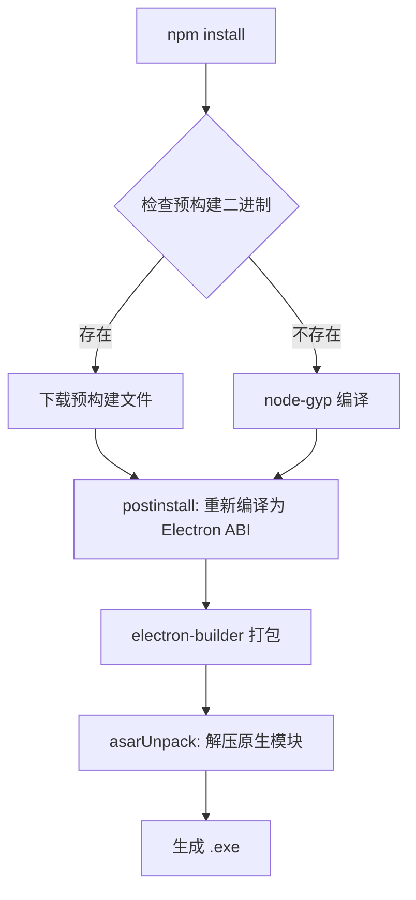

# Windows better-sqlite3 编译问题修复

## ❌ 错误信息

```
npm error code 3221225786
npm error path D:\a\server-manager\server-manager\node_modules\better-sqlite3
npm error command failed
prebuild-install warn install No prebuilt binaries found
gyp info using node-gyp@10.1.0
```

---

## 🔍 问题原因

`better-sqlite3` 是一个**原生 Node.js 模块**，包含 C++ 代码，需要：
1. 在目标平台上编译
2. 或使用预构建的二进制文件

Windows 上编译失败的原因：
- ❌ 缺少预构建的二进制文件
- ❌ node-gyp 编译过程被中断
- ❌ Electron 和 Node.js 的原生模块 ABI 不兼容

---

## ✅ 解决方案

### 修复 1：配置 .npmrc 优先使用预构建二进制

创建 `.npmrc` 文件：

```ini
# 强制使用预构建的二进制文件，避免编译
build-from-source=false
```

---

### 修复 2：配置 electron-builder 正确打包原生模块

更新 `package.json`：

```json
{
  "build": {
    "files": [
      "dist/**/*",
      "dist-electron/**/*",
      "node_modules/better-sqlite3/**/*"  // ✅ 包含原生模块
    ],
    "asarUnpack": [
      "node_modules/better-sqlite3/**/*"  // ✅ 不压缩原生模块
    ]
  }
}
```

**为什么需要 asarUnpack？**
- Electron 默认将应用打包成 asar 归档文件
- 原生模块（.node 文件）不能在 asar 中运行
- `asarUnpack` 将原生模块解压到单独目录

---

### 修复 3：添加 postinstall 脚本

更新 `package.json`：

```json
{
  "scripts": {
    "postinstall": "electron-builder install-app-deps",
    "rebuild": "electron-rebuild -f -w better-sqlite3"
  }
}
```

**作用**：
- `postinstall`: 自动为 Electron 重新编译原生模块
- `rebuild`: 手动重新编译原生模块（如果需要）

---

### 修复 4：优化 GitHub Actions 工作流

更新 `.github/workflows/build.yml`：

```yaml
# Windows: 安装构建工具
- name: Install Windows Build Tools
  if: matrix.os == 'windows-latest'
  run: npm install --global node-gyp

# 安装依赖时设置环境变量
- name: Install dependencies
  run: npm install
  env:
    npm_config_build_from_source: true  # 允许从源码编译

# Windows 打包
- name: Package for Windows
  if: matrix.os == 'windows-latest'
  run: npx electron-builder --win --x64
  env:
    GH_TOKEN: ${{ secrets.GITHUB_TOKEN }}
```

---

## 📊 修复前后对比

| 配置项 | 修复前 | 修复后 |
|-------|--------|--------|
| **.npmrc** | ❌ 不存在 | ✅ 优先使用预构建二进制 |
| **asarUnpack** | ❌ 未配置 | ✅ 解压原生模块 |
| **postinstall** | ❌ 无 | ✅ 自动重新编译 |
| **GitHub Actions** | ❌ 基础配置 | ✅ 安装构建工具 |

---

## 🧪 验证修复

### 本地测试（Windows）

```bash
# 1. 清理
rm -rf node_modules package-lock.json

# 2. 重新安装
npm install

# 3. 检查 better-sqlite3
ls node_modules/better-sqlite3/build/Release/
# 应该看到：better_sqlite3.node

# 4. 测试数据库
node test-database.js
# 应该能正常运行
```

### GitHub Actions 测试

推送代码后，在 Actions 页面查看 Windows 构建日志：

```
✅ Installing dependencies...
✅ Building application...
✅ Packaging for win32 x64 using electron-builder
✅ Building target nsis
✅ Building target portable
```

---

## 📦 Windows 打包后的文件结构

```
Server Manager.exe (便携版)
│
└── resources/
    ├── app.asar                  ← 压缩的应用代码
    └── app.asar.unpacked/        ← 未压缩的原生模块
        └── node_modules/
            └── better-sqlite3/
                └── build/
                    └── Release/
                        └── better_sqlite3.node  ✅ 原生模块
```

---

## 🎯 为什么现在能工作？

### 完整的编译流程



**关键点**：
1. ✅ `.npmrc` 优先使用预构建二进制（更快）
2. ✅ `postinstall` 确保原生模块匹配 Electron ABI
3. ✅ `asarUnpack` 确保原生模块可以被加载
4. ✅ GitHub Actions 安装了必要的构建工具

---

## ⚠️ 常见问题

### Q1: 本地开发时 better-sqlite3 报错？

```bash
# 重新编译原生模块
npm run rebuild

# 或者完全重新安装
rm -rf node_modules
npm install
```

---

### Q2: GitHub Actions 还是失败？

检查日志中的错误：

**如果看到 "No prebuilt binaries found"**:
- 正常，会继续从源码编译
- 确保 node-gyp 步骤没有错误

**如果看到 "gyp ERR!"**:
- 确保 GitHub Actions 安装了构建工具
- 检查 Python 版本（需要 3.x）

---

### Q3: 打包后运行报错 "Cannot find module 'better-sqlite3'"？

确保 `package.json` 配置正确：

```json
{
  "build": {
    "files": [
      "node_modules/better-sqlite3/**/*"  // ✅ 必须包含
    ],
    "asarUnpack": [
      "node_modules/better-sqlite3/**/*"  // ✅ 必须解压
    ]
  }
}
```

---

### Q4: 能否避免编译，只使用预构建二进制？

可以，但有限制：

```ini
# .npmrc
build-from-source=false
```

**限制**：
- 必须存在对应 Node.js 版本和平台的预构建文件
- better-sqlite3 官方提供了大部分平台的预构建文件
- 但 Electron 的 ABI 可能不同，仍需要 `postinstall` 重新编译

---

## 📚 相关资源

- [better-sqlite3 文档](https://github.com/WiseLibs/better-sqlite3)
- [electron-builder 原生模块](https://www.electron.build/configuration/contents#extraresources)
- [Electron 原生模块](https://www.electronjs.org/docs/latest/tutorial/using-native-node-modules)
- [@electron/rebuild](https://github.com/electron/rebuild)

---

## ✅ 检查清单

推送代码前，确保：

- [ ] `.npmrc` 文件已创建
- [ ] `package.json` 中 `build.asarUnpack` 已配置
- [ ] `package.json` 中 `scripts.postinstall` 已添加
- [ ] `.github/workflows/build.yml` 已更新
- [ ] `@electron/rebuild` 已安装在 devDependencies

---

## 🚀 现在可以做的

```bash
# 1. 提交所有修复
git add .
git commit -m "Fix: resolve Windows better-sqlite3 compilation issues"
git push

# 2. 触发 GitHub Actions
git tag v1.0.2
git push origin v1.0.2

# 3. 等待编译完成（15-20 分钟）

# 4. 下载 Windows 安装包
# windows-build.zip
```

---

## 🎉 预期结果

所有平台编译成功：

| 平台 | 状态 | 输出文件 |
|-----|------|---------|
| **Linux** | ✅ | Server Manager-1.0.0.AppImage |
| **Windows** | ✅ | Server Manager Setup 1.0.0.exe |
| **macOS** | ✅ | Server Manager-1.0.0.dmg |

所有平台的 better-sqlite3 原生模块都能正常工作！
