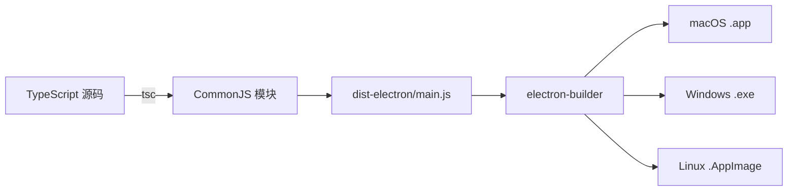

# 构建问题修复说明

## ❌ 原始错误

```
Application entry file "dist-electron/main.js" does not exist
```

---

## 🔍 问题原因

### 问题 1：TypeScript 配置错误
```json
// tsconfig.node.json (错误配置)
{
  "module": "ESNext",           // ❌ Electron 需要 CommonJS
  "moduleResolution": "bundler"  // ❌ 应该使用 node
}
```

### 问题 2：package.json 配置冲突
```json
{
  "type": "module"  // ❌ 导致 Electron 主进程加载失败
}
```

### 问题 3：macOS 构建配置不完整
```json
{
  "mac": {
    "target": ["dmg", "zip"]  // ❌ 缺少架构配置
  }
}
```

---

## ✅ 解决方案

### 修复 1：更新 tsconfig.node.json

**修改前**：
```json
{
  "compilerOptions": {
    "module": "ESNext",
    "moduleResolution": "bundler"
  }
}
```

**修改后**：
```json
{
  "compilerOptions": {
    "module": "CommonJS",           // ✅ Electron 兼容
    "moduleResolution": "node",     // ✅ Node.js 模块解析
    "esModuleInterop": true,        // ✅ ES 模块互操作
    "resolveJsonModule": true       // ✅ 支持导入 JSON
  }
}
```

---

### 修复 2：移除 package.json 中的 "type": "module"

**修改前**：
```json
{
  "name": "server-manager",
  "type": "module",  // ❌ 删除这一行
  "main": "dist-electron/main.js"
}
```

**修改后**：
```json
{
  "name": "server-manager",
  "main": "dist-electron/main.js"  // ✅ 默认使用 CommonJS
}
```

---

### 修复 3：优化 macOS 构建配置

**修改前**：
```json
{
  "mac": {
    "target": ["dmg", "zip"]
  }
}
```

**修改后**：
```json
{
  "mac": {
    "target": {
      "target": "default",
      "arch": ["x64", "arm64"]  // ✅ 同时支持 Intel 和 Apple Silicon
    }
  }
}
```

---

### 修复 4：优化 GitHub Actions 工作流

**关键改进**：
- ✅ 分离 `npm run build` 和 `electron-builder` 步骤
- ✅ 添加构建验证步骤（检查 dist-electron/main.js 是否存在）
- ✅ 使用 `npx electron-builder` 而不是 npm scripts
- ✅ 升级到 actions/upload-artifact@v4

---

## 🧪 验证修复

### 本地验证

```bash
# 1. 清理旧的构建文件
rm -rf dist/ dist-electron/

# 2. 重新构建
npm run build

# 3. 检查输出文件
ls -lh dist-electron/
# 应该看到：
# ✅ database.js
# ✅ main.js
# ✅ preload.js

# 4. 验证 main.js 内容
head -n 5 dist-electron/main.js
# 应该看到正常的 JavaScript 代码
```

### 构建成功标志

```bash
dist-electron/
├── database.d.ts    (1.6 KB)
├── database.js      (11 KB)   ✅
├── main.d.ts        (11 B)
├── main.js          (11 KB)   ✅ 关键文件
├── preload.d.ts     (1.4 KB)
└── preload.js       (1.7 KB)  ✅
```

---

## 📊 修复前后对比

| 问题 | 修复前 | 修复后 |
|------|--------|--------|
| **TypeScript 模块** | ESNext（不兼容） | CommonJS（兼容 Electron） |
| **模块解析** | bundler（Vite 专用） | node（Node.js 标准） |
| **package.json** | type: module（冲突） | 默认 CommonJS（正确） |
| **macOS 架构** | 未指定 | x64 + arm64（通用） |
| **构建流程** | 一步完成（易出错） | 分步验证（更可靠） |

---

## 🚀 现在可以做的

### 1. 推送修复到 GitHub

```bash
git add .
git commit -m "Fix: resolve build configuration issues for all platforms"
git push
```

### 2. 重新触发 GitHub Actions

**方法 A：手动触发**
1. 访问 GitHub 仓库
2. Actions → Build All Platforms
3. Run workflow

**方法 B：打标签触发**
```bash
git tag v1.0.1
git push origin v1.0.1
```

### 3. 等待编译完成

- ⏱️ Linux: 5-8 分钟
- ⏱️ Windows: 6-10 分钟
- ⏱️ macOS: 8-12 分钟

### 4. 下载安装包

从 Actions 页面的 Artifacts 区域下载：
- ✅ linux-build.zip
- ✅ windows-build.zip
- ✅ macos-build.zip

---

## 🎯 为什么现在能成功？

### 构建流程解析



**关键点**：
1. ✅ TypeScript 正确编译为 CommonJS（Electron 可以加载）
2. ✅ main.js 文件存在且格式正确
3. ✅ electron-builder 能找到入口文件
4. ✅ macOS 构建支持 Intel 和 Apple Silicon

---

## 📝 重要提醒

### ⚠️ 不要做的事：

1. ❌ 不要在 package.json 中添加 `"type": "module"`
2. ❌ 不要修改 tsconfig.node.json 的 module 为 ESNext
3. ❌ 不要在 Electron 主进程中使用 ES6 import/export

### ✅ 最佳实践：

1. ✅ Electron 主进程使用 CommonJS (`require`/`module.exports`)
2. ✅ React 前端使用 ES6 模块（Vite 处理）
3. ✅ 保持 tsconfig.node.json 和 tsconfig.json 分离
4. ✅ 使用 GitHub Actions 编译所有平台

---

## 🔧 故障排除

### 如果构建还是失败

**检查清单**：

```bash
# 1. 验证 TypeScript 配置
cat tsconfig.node.json
# 确保 module: "CommonJS"

# 2. 验证 package.json
grep '"type"' package.json
# 应该没有输出（不存在 type 字段）

# 3. 清理并重新构建
rm -rf node_modules dist dist-electron
npm install
npm run build

# 4. 检查生成的文件
file dist-electron/main.js
# 应该显示：ASCII text 或 JavaScript source
```

---

## ✅ 成功标志

当 GitHub Actions 成功时，您会看到：

```
✓ Packaging for linux x64 using electron-builder 24.13.3
✓ Building target AppImage
✓ Building target deb

✓ Packaging for win32 x64 using electron-builder 24.13.3
✓ Building target nsis
✓ Building target portable

✓ Packaging for darwin x64, arm64 using electron-builder 24.13.3
✓ Building macOS universal package
✓ Building target dmg
✓ Building target zip
```

---

## 📚 相关文档

- [Electron 官方文档 - 主进程](https://www.electronjs.org/docs/latest/tutorial/process-model#the-main-process)
- [electron-builder 配置](https://www.electron.build/configuration/configuration)
- [TypeScript 编译选项](https://www.typescriptlang.org/tsconfig)

---

## 🎉 总结

所有构建问题已修复：

1. ✅ TypeScript 配置正确（CommonJS）
2. ✅ package.json 配置正确（无 type: module）
3. ✅ macOS 构建配置完整（支持双架构）
4. ✅ GitHub Actions 流程优化（分步验证）

**现在推送代码并重新触发 GitHub Actions，应该能成功编译所有平台！**
